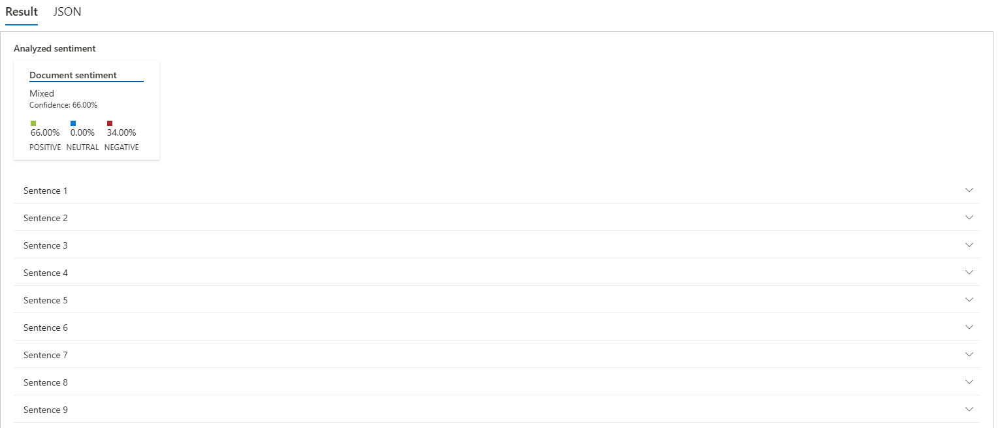

# AzureIA
## Language Studio
### Analyze sentiment and opinions

Acessando o Serviço

Selecionando os recursos 

Confirmando a criação do recurso

Acesando o Language Studio e o Analyze Sentiment and Opnions

Selecionando o Recurso criado na configurações

Inserindo o Input enviando o arquivo inputs.txt

Resultado geral do Input

### Observações

Os exemplos usados no inputs, são opniões reais coletatas na plataforma Steam(Loja online de jogos) Para maior aproximidade com o cenario.

Foram coletado 4 opnioes positivas e 5 negativas, sendo da negativa uma era ironia onde a IA não conseguiu deferir o resultado preciso, talvez pela forma da linguagem incomun *(setença 6)*.

Para a leitura correta das sentenças como unicas alguns caracteres tiveram que ser substituidos, os sinais foram o Ponto, Exclamação e Interrogação.

